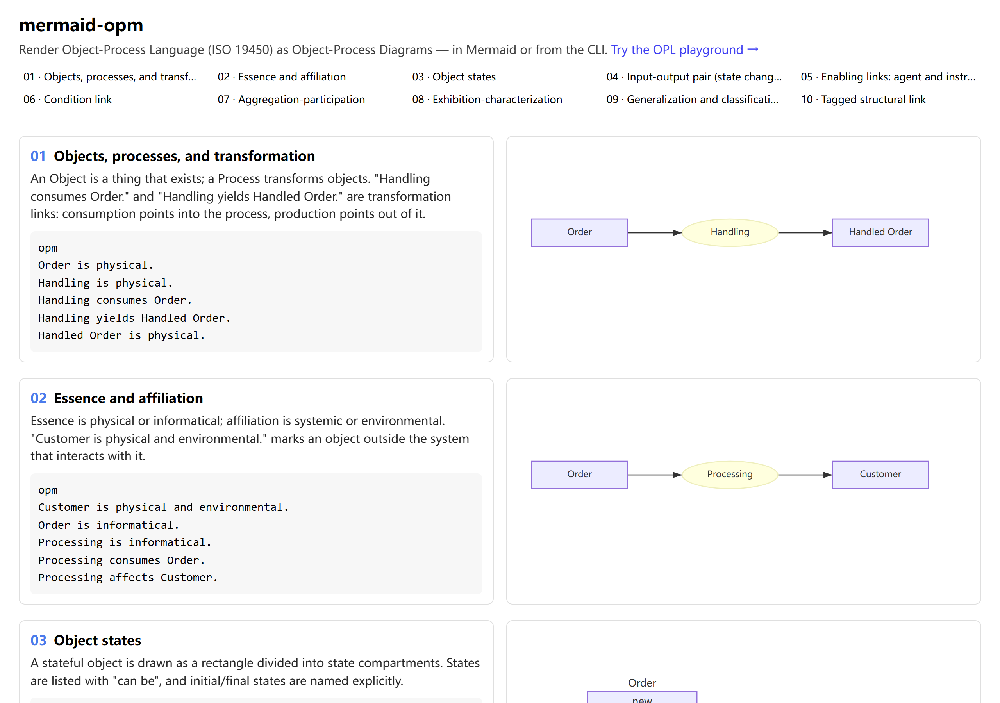

# mermaid-opm

将 ISO 19450 OPM/OPL 渲染为对象-过程图（OPD）的 Mermaid 外部图表插件，另附一个 CLI。



[](https://github.com/fengdonglu/mermaid-opm/actions/workflows/ci.yml)
[](https://github.com/fengdonglu/mermaid-opm/releases/latest)
[](LICENSE)

[English](README.md) | 中文

> 本文是 [README.md](README.md) 的中文副本。若中英文内容冲突，以英文版为准。

## 项目简介

对象-过程方法（OPM）是 ISO 19450 定义的系统建模范式，只用两个基本构件来描述系统——**对象**（存在之物）与**过程**（改变对象之物）。对象-过程语言（OPL）是其文本形式，对象-过程图（OPD）是其图形形式；二者是同一模型的双模态视图。

`mermaid-opm` 将一门小型、类英语的 OPL 方言解析为模型，用 [dagre](https://github.com/dagrejs/dagre) 布局，再输出 SVG。它有两种形态：

- **Mermaid 外部图表插件**——编写 `opm` 代码块，由 Mermaid 在浏览器中渲染；
- **CLI**（`opm2svg`）——用于批量转换与 CI。

## 安装（尚未发布）

`mermaid-opm` **尚未发布到 npm**，也没有 VS Code Marketplace 条目。目前请从仓库自行构建使用：

```bash
git clone https://github.com/fengdonglu/mermaid-opm
cd mermaid-opm
npm install
npm run build
```

构建会产出 `dist/index.js`（Node 用的库/插件 API）、`dist/mermaid-opm.mjs`（Mermaid 插件的浏览器 bundle）与 `dist/cli/cli.js`（`opm2svg` CLI）。浏览器中使用 Mermaid 插件时，请托管构建出的 `dist/mermaid-opm.mjs`；该 bundle 内部保留裸 `import('mermaid')`，因此需用 import map 把 `mermaid` 映射到 ESM URL：

```html
<script type="importmap">
{
  "imports": {
    "mermaid": "https://cdn.jsdelivr.net/npm/mermaid@12/dist/mermaid.esm.min.mjs"
  }
}
</script>
<script type="module">
  import mermaid from 'mermaid';
  import { registerOpm } from './dist/mermaid-opm.mjs'; // 按你托管的路径调整

  mermaid.initialize({ startOnLoad: false });
  await registerOpm();
</script>
```

## 快速开始 —— Mermaid 插件

渲染前先注册外部图表：

```js
import mermaid from 'mermaid';
import { registerOpm } from './dist/mermaid-opm.mjs'; // 构建出的浏览器 bundle

mermaid.initialize({ startOnLoad: false });
await registerOpm();

const { svg } = await mermaid.render('d', `
opm
Order is physical.
Handling is physical.
Handling consumes Order.
Handling yields Handled Order.
Handled Order is physical.
`);
document.querySelector('#diagram').innerHTML = svg;
```

传给 `mermaid.render` 的源码即 OPL 方言：

```opm
Order is physical.
Handling is physical.
Handling consumes Order.
Handling yields Handled Order.
Handled Order is physical.
```

## 快速开始 —— CLI

```bash
node dist/cli/cli.js model.opl -o model.svg
node dist/cli/cli.js model.opl -o model.svg --json model.json
```

（执行 `npm link` 后可直接使用 `opm2svg` 命令。）

输入文件会转换为 SVG（默认输出名为输入名加 `.svg` 后缀）。`--json` 会额外写出解析后的模型及其诊断。存在 `error` 级诊断时以非零码退出；未知参数会以用法错误拒绝。

## 编辑器（VS Code）

`mermaid-opm-vscode` 扩展为 `.opl` 提供语法高亮、实时诊断、补全、悬停与大纲，并带有 **OPM: Open Preview** 与 **OPM: Export SVG** 两个命令。它内置 `mermaid-opm-lsp` 语言服务器。安装与使用见 [《VS Code 扩展》](docs/usage/vscode.zh.md)。

## 演示

`demo/index.html` 是一个两栏静态画廊，并排展示十个 OPL 示例及其 OPD：

- 画廊：[`demo/index.html`](demo/index.html) —— 十个带编号的示例，源码与其 OPD 并排。
- Playground：[`demo/playground.html`](demo/playground.html) —— 编辑 OPL，实时查看 OPD 与诊断。
- 在线：https://fengdonglu.github.io/mermaid-opm/demo/ —— 要启用部署，请在仓库设置中把 Pages 源设为 **GitHub Actions**。
- 本地：先 `npm run build`（页面加载 `dist/mermaid-opm.mjs`），再 `npm run dev`，打开服务页面。

## 支持范围

v1 子集涵盖：

- **实体**——对象与过程，按角色推断，并带本质（`physical` / `informatical`）与归属（`systemic` / `environmental`）：`A is physical and environmental.`
- **状态**——`A can be s1, s2, or s3.`，具名初始/终止状态（`A is initial s1.` / `A is final s1.`）。
- **结构链接**——聚合（`Whole consists of A, B, and C.`）、展示（`A exhibits B.`）、泛化（`Special is a General.`）、分类（`Instance is an instance of Class.`）以及用户自定义的带标签链接。
- **过程链接**——消耗（`Process consumes Object.`）、产生（`Process yields Object.`）、影响（`Process affects Object.`）、输入-输出对（`Process changes Object from s1 to s2.`）、代理（`Agent handles Process.`）、工具（`Process requires Instrument.`）与条件（`Process occurs if Object is s1.`）。

## 不支持（v1）

- 多 OPD / 下钻（in-zoom）/ 展开（unfold）。
- `event`、`result`、`invocation` 链接。
- 图形化编辑或布局持久化。
- 裸写的 `A is initial.` / `A is final.`——初始与终止状态必须具名，例如 `A is initial s1.`
- 无冠词的过程泛化 `Special is General.`——它会被解析为状态；请改用带冠词形式 `Special is a General.`
- 编辑器中的跳转定义与格式化（见[路线图](#路线图)）。

## 已知限制

- 外部 Mermaid 图表要求宿主页面加载本插件。像 GitHub Markdown 这样的固定渲染器不会加载第三方插件，因此其中的 `opm` 代码块不会渲染——请改用 CLI 生成 SVG。
- 演示页加载 `../dist/mermaid-opm.mjs`，因此打开 `demo/index.html` 前需先 `npm run build`。
- 主题颜色取自 Mermaid 解析后的主题变量（背景、线条/文字以及主/次调色板）。Mermaid 只暴露该调色板，而非 OPM 专有语义；如需完整的 OPM 调色板，请向 `renderSvg` 显式传入 `Theme`。

## 文档

完整文档位于 [`docs/`](docs/index.zh.md)：

- **使用** —— [快速开始](docs/usage/getting-started.zh.md)、
  [OPL 语法](docs/usage/opl-syntax.zh.md)、[CLI](docs/usage/cli.zh.md)、
  [Mermaid 插件](docs/usage/mermaid-plugin.zh.md)、
  [编辑器集成](docs/usage/editor-integration.zh.md)、
  [VS Code 扩展](docs/usage/vscode.zh.md)。
- **开发** —— [架构](docs/development/architecture.zh.md)、
  [构建与测试](docs/development/build-and-test.zh.md)、
  [集成](docs/development/integration.zh.md)、
  [扩展](docs/development/extending.zh.md)、
  [路线图](docs/development/roadmap.zh.md)。
- **关于** —— [什么是 OPM/OPL](docs/about/what-is-opm-opl.zh.md)、
  [参考资料](docs/about/references.zh.md)、[常见问题](docs/about/faq.zh.md)。

## 路线图

后续版本计划：

- `event` / `result` / `invocation` 链接，以及带状态限定的消耗与产生。
- 面向过程的无冠词泛化。
- CLI 的 `--theme` 与 `--strict` 选项（strict 将歧义转为错误）。
- 替代布局引擎（ELK）。
- [VS Code 扩展](docs/usage/vscode.zh.md)中的跳转定义与格式化。

## 开发说明

本项目通过 AI 辅助的 **Vibe Coding** 方式开发，由智能体与人类迭代协作完成。

## 许可证

[MIT](LICENSE) © fengdonglu
